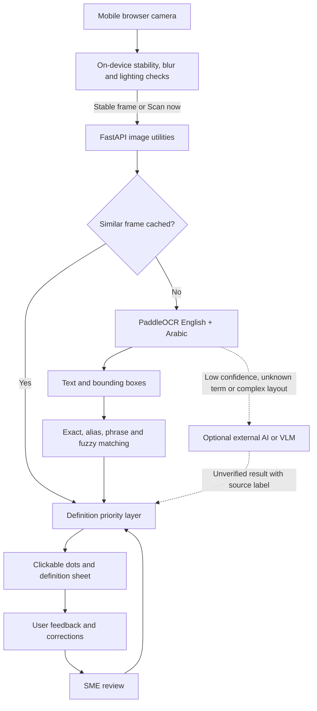

# FalconScan

FalconScan is a bilingual, AI-assisted camera companion for customs documents. It lets a non-specialist point a phone or webcam at a manifest, bill of lading, airway bill, declaration, invoice, packing list, delivery order, or port-clearance form and tap contextual dots for plain-language definitions.

The product is deliberately **glossary-first and CPU-first**. The browser provides continuous camera feedback and detects stable, sharp, well-lit frames. Only a stable frame—or an explicit “Scan now”—is sent to the backend. PaddleOCR handles English and Arabic text; local services then match customs terminology. A VLM is an optional, separately hosted enhancement, never a requirement for the core app.

## 1. Project overview

FalconScan is an end-to-end, camera-based customs terminology assistant for Dubai Customs, freight-forwarding desks, free-zone operators, logistics teams, and trade-compliance staff. Phase 1 delivers the CPU-friendly scanning loop; Phase 2 adds governed knowledge and feedback; Phase 3 defines optional AI/VLM enhancement without making it a core dependency.

## 2. Problem statement

Customs paperwork assumes specialist vocabulary. Staff often lose context by switching to a search tool or relying on an unverified explanation. FalconScan keeps the explanation attached to the physical term in the camera view.

## 3. Functional requirements

Requirements implemented:

- Camera permission, live preview, local motion/blur/lighting signals, stable-frame auto-capture, and manual capture.
- English and Arabic PaddleOCR with word/line bounding boxes.
- Exact, case-insensitive, acronym, alias, Arabic, multi-word phrase, and fuzzy OCR matching.
- Clickable dot overlays, bilingual definition cards, confidence, source labels, related terms, and RTL display.
- Thumbs-up/down feedback, correction entry, local audit history, pending review, and SME approve/reject UI.
- Definition priority: SME-approved → pending user correction → verified glossary → optional knowledge/RAG layer → cautious AI fallback. SME approval intentionally overrides pending user text because it is the governed official answer.
- Optional VLM gate for low confidence, unknown terms, complex layouts, or explicit full-document analysis.

## 4. Non-functional requirements

- **Mobile-first responsive design:** phone portrait is the primary interaction target. Camera controls, scanning status, definition sheets, and feedback use touch-friendly dimensions and safe-area spacing. Tablet and desktop layouts progressively enhance the same interface without removing features.
- CPU usability, bounded OCR cache, lazy model loading, and graceful operation without VLM.
- No saved document images by default, clear provenance, and governed corrections.
- Simple JSON persistence for the MVP and an API shape ready for later database/RAG migration.
- Accessible semantics, readable contrast, RTL definitions, reduced-motion support, and 320px minimum viewport support.

## 5. Architecture

The phone performs the continuous, latency-sensitive work. The backend only receives a stable or explicitly captured frame, performs cache/OCR/knowledge lookup, and returns terms with coordinates. Feedback feeds a human-governed approval loop. Optional VLM analysis is isolated from the routine path.



The definition layer applies governed precedence: SME-approved definition, pending user correction, verified glossary, future RAG retrieval, then explicitly unverified AI fallback. Full document images are not persisted.

## 6. Folder structure

```text
Browser camera
  → local stability / blur / light checks
  → one JPEG on stable or manual capture
  → FastAPI → perceptual cache → PaddleOCR (EN + AR)
  → corrections / SME / glossary / optional RAG / AI priority
  → bounding boxes + definitions → clickable overlay
  → feedback audit → SME approval
  ↘ optional external VLM only when gated
```

```text
app.py                       FastAPI routes and orchestration
backend/ocr_service.py       Lazy bilingual PaddleOCR adapter
backend/glossary_service.py  Matching and definition priority
backend/feedback_service.py  Corrections, audit, SME workflow
backend/ai_definition_service.py  Conservative AI fallback boundary
backend/vlm_service.py       Phase 3 trigger and endpoint gate
backend/image_utils.py       Decode, quality, frame fingerprint
backend/progress_service.py  Persistent project checkpoint
frontend/                    Camera UI, overlay, feedback, styles
data/                        Glossary, corrections, approvals, cache
tests/                       Service and API tests
```

## 7. Data model

`data/glossary.json` is RAG-ready rather than a flat string map. Each canonical term can have aliases, full form, English and Arabic definitions, category, related terms, document types, and provenance. Twenty seed concepts include B/L, MAWB, HAWB, HS Code, CIF, FOB, COO, TIR, FZE, customs duty, consignee, shipper, manifest, and key trade documents.

Corrections are separated into pending user suggestions and SME-approved definitions. Feedback history is append-only. For a multi-instance production deployment, replace the JSON repositories with SQLite/Postgres or a Hugging Face Dataset while keeping the service interfaces.

## 8. Glossary examples

The seeded bilingual knowledge includes B/L, MAWB, HAWB, HS Code, CIF, FOB, COO, TIR, FZE, Bonded Warehouse, Customs Duty, Consignee, Shipper, Manifest, Declaration Number, Incoterms, Delivery Order, Packing List, and Commercial Invoice. Each record can carry aliases, Arabic equivalents, category, document types, related terms, definition provenance, and confidence.

## 9. APIs

- `POST /analyze-frame` — base64 image, dimensions, language preference; returns detected terms, bounding boxes, OCR confidence, quality, cache state, unknown text, and VLM suggestion.
- `POST /analyze-document` — analyzes uploaded JPG, PNG, WebP, PDF, or DOCX; renders a private preview and returns positioned terms with definitions.
- `POST /explain-selection` — turns selected OCR text or a highlighted paragraph into a sourced summary and business meaning.
- `GET /definition/{term}?language=en` — best governed definition or a labeled verification fallback.
- `POST /submit-feedback` — records positive feedback or a correction.
- `GET /admin/corrections` — pending review queue.
- `POST /admin/review` — approve or reject a suggestion.
- `POST /analyze-document-vlm` — explicit Phase 3 gate; remains graceful when unconfigured.
- `GET /health` and `GET /progress` — runtime and project state.

Interactive schemas are available at `/docs`.

## 10. Frontend camera workflow

The camera samples a tiny 96×72 canvas locally. Average pixel change estimates motion, vertical luminance differences provide a cheap focus signal, and brightness detects darkness/glare. Twelve good samples trigger one capture, with an eight-second cooldown. Phone portrait is the baseline UI: the camera comes first, controls are touch-sized, status remains readable over video, and definitions open as bottom sheets. At 900px and above, the scanner and control panel become a two-column desktop workspace.

## 11. Backend OCR workflow

The backend decodes one stable JPEG, computes an image-quality signal and visual fingerprint, then checks the bounded cache. A cache miss invokes lazy English and Arabic PaddleOCR. The backend hashes a 16×16 luminance thumbnail and reuses one of at most 100 cached OCR results for visually similar frames. Original images are not written to disk.

## 12. Matching logic

OCR detections retain source coordinates. The browser maps them through the contained-video scale and offsets. Definitions are selected by canonical/alias normalization, longest phrase containment, then a 0.78 fuzzy threshold. OCR and match confidence are combined and always displayed as a confidence signal—not as legal certainty.

## 13. Feedback correction logic

A thumbs-down correction immediately becomes the preferred pending user explanation. Feedback events remain in the audit history. The header badge shows the actual pending-review count and stays hidden when the count is zero or unavailable.

## 14. SME approval workflow

The SME queue shows current and suggested text, author, timestamp, and actions. Approval copies the definition into the governed store; rejection removes it from the active priority path while preserving the audit record. An approved correction becomes the official answer and overrides pending user text.

## 15. AI fallback logic

Unknown-term AI output is intentionally conservative and labeled `ai_generated_unverified`. Set `FALCONSCAN_AI_ENDPOINT` and `HF_TOKEN` only after implementing the chosen provider adapter. If no endpoint exists, FalconScan says that the term needs customs-expert verification rather than guessing.

## 16. VLM enhancement workflow

`FALCONSCAN_VLM_ENDPOINT` configures the optional Phase 3 boundary. A VLM should run outside the CPU web process and only for an explicit request, low OCR confidence, unknown content, stamps/tables, or complex layout. It must not replace word localization or the governed glossary.

## 17. Run and deploy

Lightweight local UI/API development (no OCR model):

```bash
python -m venv .venv
source .venv/bin/activate
pip install -r requirements-lite.txt
FALCONSCAN_OCR_ENABLED=false uvicorn app:app --reload
```

Fast local OCR (default English CPU path):

```bash
pip install -r requirements.txt
uvicorn app:app --host 0.0.0.0 --port 7860
```

The Docker image also installs Arabic Tesseract data. For optional PaddleOCR research or custom multilingual models, install `requirements-advanced.txt` and set `FALCONSCAN_OCR_ENGINE=paddle`; this is intentionally excluded from the default free-Space path to avoid multi-minute model downloads.

Open `http://localhost:7860`. Camera access requires localhost or HTTPS. The first English/Arabic scan downloads PaddleOCR models and therefore has a cold start.

For Hugging Face Spaces:

1. Create a **Docker Space** using a free CPU hardware tier.
2. Push this repository. The README metadata and Dockerfile expose port 7860.
3. Allow the initial image build and model download. If build size is tight, preselect only the languages you need or host model files in a Dataset.
4. Add `HF_TOKEN`, `FALCONSCAN_AI_ENDPOINT`, or `FALCONSCAN_VLM_ENDPOINT` as secrets only if optional remote services are implemented.
5. Treat local JSON as demo persistence: free Spaces may restart. Use persistent storage, a Dataset, or an external database before operational use.
6. Test on HTTPS with a real phone and representative, anonymized documents.

## 18. Testing plan

Run `pip install -r requirements-dev.txt && pytest -q`. Automated tests cover health, exact/Arabic/fuzzy definitions, invalid images, VLM-disabled behavior, and SME priority. Manual acceptance cases:

1. B/L on a bill of lading produces a dot and definition.
2. MAWB on an airway bill is recognized.
3. `رمز النظام المنسق` can display Arabic or English.
4. Thumbs down saves a correction; the next lookup uses it.
5. SME approval overrides pending user text.
6. Poor capture suggests full-document analysis.
7. Unknown terms get an explicitly unverified verification message.
8. Admin can approve/reject with an audit timestamp.
9. The app stays useful when VLM is disabled.
10. Images never appear in `data/` after scans.

## 19. Performance, security, and governance

- Never OCR each frame; keep continuous work in the browser and send stable/manual frames only.
- Resize before upload later if real documents show 1280px is sufficient; current capture preserves camera resolution for OCR quality.
- Keep OCR lazy, cache by visual fingerprint, cap the cache, and avoid loading a VLM in-process.
- Do not store full images by default. Persist only terms, definitions, feedback, confidence, status, and timestamps.
- Put admin routes behind authentication before real deployment. Add rate limits, request-size limits, encryption, retention rules, and named SME identities.
- Treat all definitions as assistance, not a customs ruling. Only governed SME content should become official knowledge.

## 20. Progress checkpoint

PROGRESS CHECKPOINT:
- Completed: End-to-end camera UI, stability capture, bilingual OCR adapter, bounding boxes, glossary/fuzzy matching, dot overlays, definitions, feedback, SME workflow, guarded AI/VLM paths, data, tests, and Docker Space configuration.
- In progress: Real-device and production Space validation.
- Pending: Install/warm PaddleOCR models; connect optional remote AI/VLM provider; replace demo JSON for durable multi-user storage; add production authentication.
- Current file being worked on: `README.md` (handoff complete).
- Next exact step: Deploy to a free CPU Docker Space and test the ten manual scenarios with anonymized English/Arabic documents.
- Important decisions made: Browser stability creates real-time feel; glossary remains primary; images are never persisted; SME-approved text outranks pending user corrections; VLM runs only behind an explicit external gate.
- Known issues: Default Space disk is ephemeral; OCR cold start can be slow; PaddleOCR footprint is substantial; AI/VLM provider adapters are intentionally unimplemented until an endpoint contract is selected.
